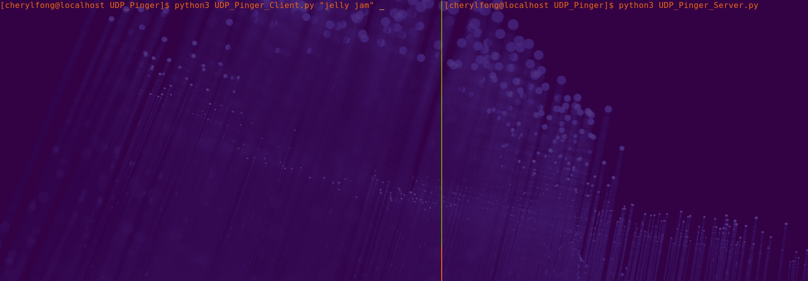
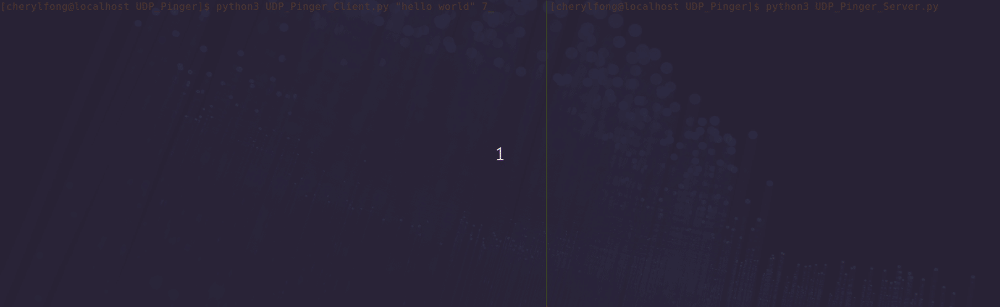

### UDP Pinger

#### UDP Ping Server

 The server side of this program i.e. `UDPPingServer.py` listens infinitely for incoming UDP packets. It will return the client's message in as all uppercase characters.

 **Server Behavior**:  

 When a packet is received, and if the randomized int is > than or equal to `4`, the server responds by capitalizing the encapsulated data and sends it back to the UDP client.

 The randomized integer servers as an artificial packet loss simulation to mimic the effects of a network packet loss. UDP does not provide reliable transport service and in reality messages will get lost in the network due to router queue overflows, faulty hardware, etc.

 Packet loss is usually rare or non-existent in a typical enterprise network.
 Simply put, the randomized int determines whether a particular incoming packet is lost in this simulation.

 This program is an extension of [`UDPServer.py`](../UDP/UDPServer.py), with simulated packet lost and repeated pings.

 **Note**: Terminate the server by pressing <kbd>CTRL</kbd> + <kbd>c</kbd> before exiting the terminal.

#### UDP Ping Client

 This client program i.e. `UDPPingClient.py` will require a message and an optional number of pings (default is 10 pings) to send to the server upon executing.
 To start this client program simply run, `python3 UDPPingClient "message to server in lowercase" N`, where `N` optional is the number of pings.

 **Client Behavior**:

 This client program is set to send the message to `localhost` at port `12000`, which is defined in `UDPPingServer.py`.

 If the server fails to return/send the uppercase message within `1` second, the client's socket will timeout. The client continues to send the same message to the server until `10` or `N` copies were sent.

 Overall, this client side program is intended to mimic the GNU `iputil`'s `ping` command. Hence before this client program terminates, ping statistics for `localhost` are displayed.

 `rtt` == Round Trip Time : The time for the message sent from the client to the server and back to the client.

#### demo : Optional Number of Pings

#### demo : When UDP Pinger Server is Not Running

